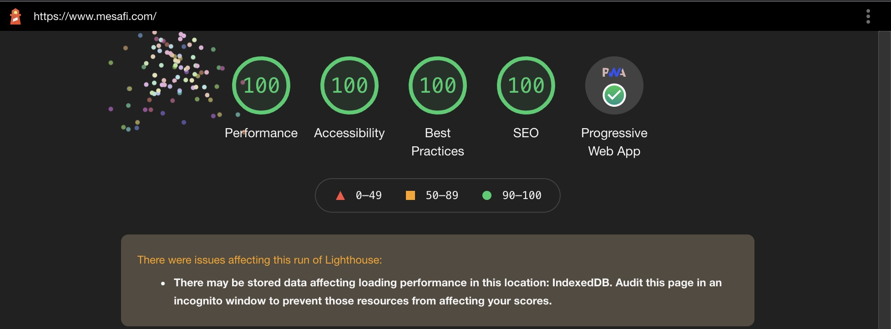

	

<h1 align="center">
	Mohammed Esafi
</h1>

	The second iteration of <a href="http://mesafi.com/" target="_blank">mesafi.com</a> built with <a href="https://www.gatsbyjs.org/" target="_blank">Gatsby</a> and hosted with <a href="https://www.netlify.com/" target="_blank">Netlify</a>

	

